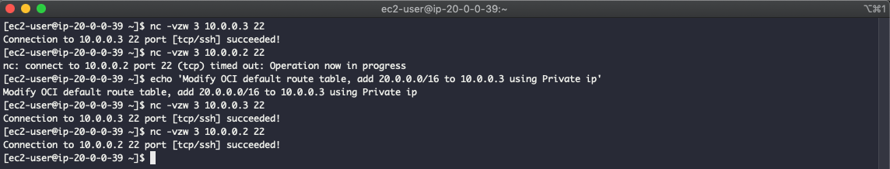

# VPN test on AWS using OpenSwan

| Region | VPC-Name | CIDR        | EC2                        | Private IP | Public IP     | OS            |
| ------ | -------- | ----------- | -------------------------- | ---------- | ------------- | ------------- |
| OCI    | Seoul    | 10.0.0.0/16 |                            |            |               |               |
|        |          |             | Public-OpenSwan-NFS-Server | 10.0.0.3   | 132.145.95.50 | OEL6          |
|        |          |             | Public-NFS-Client          | 10.0.0.2   |               | OEL7          |
| AWS    | Tokyo    | 20.0.0.0/16 |                            |            |               |               |
|        |          |             | Public-EC2                 | 20.0.0.39  |               | Amazon Linux1 |
|        |          |             | Private-EC2                | 20.0.1.166 |               | Amazon Linux1 |


**Using Amazon Linux 1 - ami-066b76d09a3d3ff4e**


# Create OCI Instance and Install OpenSwan

```
[opc@openswan-oel6 ~]$ mkdir -p ~/backup/
[opc@openswan-oel6 ~]$ sudo cp /etc/sysctl.conf ~/backup
[opc@openswan-oel6 ~]$ grep ip_forward  /etc/sysctl.conf^C
[opc@openswan-oel6 ~]$ set -o vi
[opc@openswan-oel6 ~]$ sudo grep ip_forward /etc/sysctl.conf
net.ipv4.ip_forward = 0
[opc@openswan-oel6 ~]$ sudo sed -i 's/net.ipv4.ip_forward = 0/net.ipv4.ip_forward = 1/g' /etc/sysctl.conf
[opc@openswan-oel6 ~]$ sudo grep ip_forward /etc/sysctl.conf
net.ipv4.ip_forward = 1

[opc@openswan-oel6 ~]$ sudo sysctl -p /etc/sysctl.conf
net.ipv4.ip_forward = 1
net.ipv4.conf.default.rp_filter = 1
net.ipv4.conf.default.accept_source_route = 0
kernel.sysrq = 0
kernel.core_uses_pid = 1
net.ipv4.tcp_syncookies = 1
kernel.msgmnb = 65536
kernel.msgmax = 65536
kernel.shmmax = 68719476736
kernel.shmall = 4294967296


[opc@openswan-oel6 ~]$ sudo yum install openswan

[opc@openswan-oel6 ~]$ sudo cp /etc/ipsec.conf ~/backup

[opc@openswan-oel6 ~]$ sudo vi /etc/ipsec.d/tunnel.conf
[opc@openswan-oel6 ~]$ sudo cat /etc/ipsec.d/tunnel.conf
conn tunnel_oci_aws
     type=tunnel
     authby=secret
     left=%defaultroute
     leftid=132.145.95.50            # Openswan인스턴스의 EIP
     leftnexthop=%defaultroute
     leftsubnet=10.0.0.0/16     #VPC CIDR
     right=y.y.y.y              #추후 VGW Config에서 확인할 Remote Tunnel IP
     rightsubnet=20.0.0.0/16    #추후 생성할 Remote VPC 1의 CIDR
     pfs=yes
     auto=start

[opc@openswan-oel6 ~]$ sudo vi /etc/ipsec.d/tunnel.secrets
[opc@openswan-oel6 ~]$ sudo cat /etc/ipsec.d/tunnel.secrets
#Openswan_EIP Remote_Tunnel-IP: PSK "Pre-Shared Key"
```

## Create Virtual Private Gateway

<kbd>  </kbd>

<kbd>  </kbd>

<kbd>  </kbd>

*OCI OpenSwan EIP Check*

<kbd>  </kbd>

*Create VPN Connection*

<kbd>  </kbd>

*Download VPN Configuration*

<kbd>  </kbd>

<kbd>  </kbd>

*Check First VPN tunnel IP*

<kbd>  </kbd>

*Modify right IP from previous "First VPN tunnel IP"*
```
[opc@openswan-oel6 ~]$ sudo vi /etc/ipsec.d/tunnel.conf
[opc@openswan-oel6 ~]$ sudo cat /etc/ipsec.d/tunnel.conf
conn tunnel_oci_aws
     type=tunnel
     authby=secret
     left=%defaultroute
     leftid=132.145.95.50            # Openswan인스턴스의 EIP
     leftnexthop=%defaultroute
     leftsubnet=10.0.0.0/16     #VPC CIDR
     right=52.199.177.210 #추후 VGW Config에서 확인할 Remote Tunnel IP
     rightsubnet=20.0.0.0/16    #추후 생성할 Remote VPC 1의 CIDR
     pfs=yes
     auto=start
```

*Idenfiying Shared key from VPN configuration file*  
```
kiwony@kiwonymac.com:/Users/kiwony/Documents/GitHub/VPN/AWS-OCI-VPN> grep -i pre-share vpn-08d8a884e441e5e96.txt
  - Authentication Method    : Pre-Shared Key
  - Pre-Shared Key           : ykdzzxykolYvqpja90zWaevu5jsaFt9n
  - Authentication Method    : Pre-Shared Key
  - Pre-Shared Key           : I5VNXqBUWtZWcu8o1I7Zq_oXwSxnqPXX
```

*Modifying tunnel.secrets file based on following factors*

```
[opc@openswan-oel6 ~]$ sudo cat  /etc/ipsec.d/tunnel.secrets
#Openswan_EIP Remote_Tunnel-IP: PSK "Pre-Shared Key"
132.145.95.50	52.199.177.210: PSK "ykdzzxykolYvqpja90zWaevu5jsaFt9n"

[opc@openswan-oel6 ~]$ sudo service ipsec restart
Starting pluto IKE daemon for IPsec: Initializing NSS database
See 'man pluto' if you want to protect the NSS database with a password

which: no restorecon in (/usr/sbin:/sbin:/usr/sbin:/usr/local/bin:/bin:/usr/bin)
.                                                          [  OK  ]

[opc@openswan-oel6 ~]$ sudo service ipsec status
pluto (pid  1618) is running...
IPsec connections: loaded 3, active 1
```

<kbd>  </kbd>

**Modifying routing table in AWS**

*Region : Tokyo*

Services => VPC => Route Tables

Select Tokyo-Private-RT

"Edit routes" Click

Add route entry 10.0.0.0/16(OCI Dest) pointing to VGW

<kbd>  </kbd>

<kbd>  </kbd>


Changing public routing table same as private routing table

<kbd>  </kbd>

<kbd>  </kbd>

*SSH connection check from OCI to AWS, OCI-openswan-oel6(10.0.0.3) => AWS-EC2(20.0.1.166)*

<kbd>  </kbd>

*SSH connection test from AWS to OCI, OCI-VPN-Instance(10.0.0.3), OCI-Instance(10.0.0.2)*
*Fail to connect to 10.0.0.2*

<kbd>  </kbd>

*Add route tables in OCI, to forward traffic to 10.0.0.3 when its destination is 20.0.0.0/16*

<kbd>  </kbd>

<kbd>  </kbd>

<kbd>  </kbd>

*Now from AWS to OCI connection test is okay*

<kbd>  </kbd>


[root@ip-20-0-0-39 ~]# yum --enablerepo=epel install iperf iperf3

[root@ip-20-0-0-39 ~]# iperf3 -s -p 80
-----------------------------------------------------------
Server listening on 80
-----------------------------------------------------------


[root@openswan ~]# yum install iperf iperf3
[root@openswan ~]# iperf3 -c 20.0.0.39 -t 60 -V -p 80


<kbd>  </kbd>


<kbd>  </kbd>


