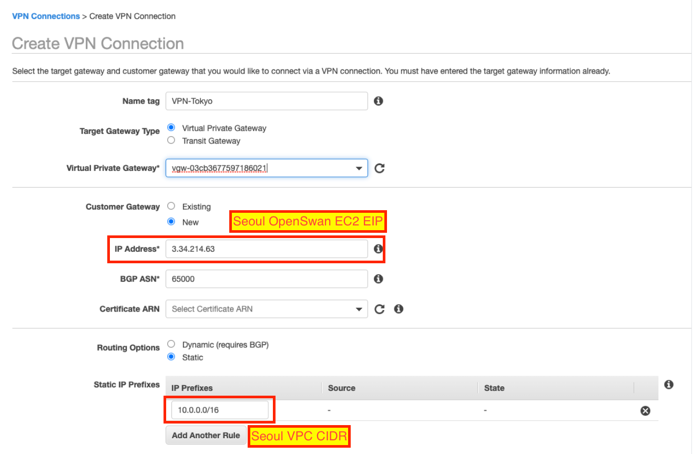
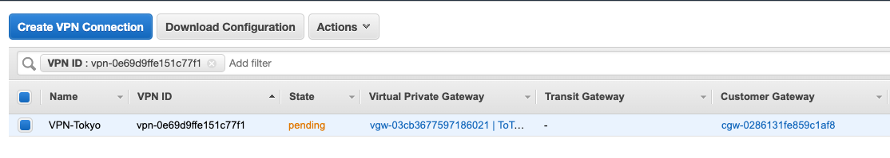

# VPN test on AWS using OpenSwan

| Region | VPC-Name | CIDR        | EC2             | Private IP | Public IP   | etc1 | etc2 |
| ------ | -------- | ----------- | --------------- | ---------- | ----------- | ---- | ---- |
| Seoul  | Seoul    | 10.0.0.0/16 |                 |            |             |      |
|        |          |             | Public-OpenSwan | 10.0.0.112 | 3.34.214.63 |      |
|        |          |             | Private-EC2     | 10.0.1.210 |             |      |
| Tokyo  | Tokyo    | 20.0.0.0/16 |                 |            |             |      |
|        |          |             | PublicEC2       | 20.0.0.39  |             |      |
|        |          |             | PrivateEC2      | 20.0.1.166 |             |      |

**Using Amazon Linux 1**


# Create Seoul VPC 10.0.0.0/16 & EC2 Instances

<kbd>  </kbd>

## Create EC2 Instance on Seoul VPC, One in Public, Another one in Private

***OpenSwan EC2 in Public Subnet*** 

Security Group - Seoul-OpenSwan

| Protocol | Source-Name |
| -------- | ----------- |
| SSH      | 0.0.0.0/0   |
| ALL ICMP | 0.0.0.0/0   |

Action => Networking => "Change Source/Dest. Check" => Disable

***Test EC2 Instance in Private Subnet*** 

**Connect to OpenSwan EC2**

```
[ec2-user@ip-10-0-0-112 ~]$ sudo yum update
[ec2-user@ip-10-0-0-112 ~]$ mkdir backup
[ec2-user@ip-10-0-0-112 ~]$ sudo cp /etc/sysctl.conf ~/backup/
[ec2-user@ip-10-0-0-112 ~]$ grep ip_forward /etc/sysctl.conf
net.ipv4.ip_forward = 0
[ec2-user@ip-10-0-0-112 ~]$ sudo sed -i 's/net.ipv4.ip_forward = 0/net.ipv4.ip_forward = 1/g' /etc/sysctl.conf
[ec2-user@ip-10-0-0-112 ~]$ grep ip_forward /etc/sysctl.conf
net.ipv4.ip_forward = 1
[ec2-user@ip-10-0-0-112 ~]$ sudo sysctl -p /etc/sysctl.conf
net.ipv4.ip_forward = 1
net.ipv4.conf.default.rp_filter = 1
net.ipv4.conf.default.accept_source_route = 0
kernel.sysrq = 0
kernel.core_uses_pid = 1
net.ipv4.tcp_syncookies = 1
kernel.msgmnb = 65536
kernel.msgmax = 65536
kernel.shmmax = 68719476736
kernel.shmall = 4294967296

[ec2-user@ip-10-0-0-112 ~]$ sudo yum install openswan
[ec2-user@ip-10-0-0-112 ~]$ sudo cp /etc/ipsec.conf ~/backup

[ec2-user@ip-10-0-0-112 ~]$ sudo vi /etc/ipsec.conf
[ec2-user@ip-10-0-0-112 ~]$ sudo diff ~/backup/ipsec.conf /etc/ipsec.conf
23c23
< #include /etc/ipsec.d/*.conf
---
> include /etc/ipsec.d/*.conf
```


**Get public ip from OpenSwan EC2**

```
[ec2-user@ip-10-0-0-112 ~]$ curl http://169.254.169.254/latest/meta-data/public-ipv4
3.34.214.63
```

**Modify tunnel.conf & Create tunnel.secrets**

```
[ec2-user@ip-10-0-0-112 ~]$ sudo vi /etc/ipsec.d/tunnel.conf
[ec2-user@ip-10-0-0-112 ~]$ sudo cat /etc/ipsec.d/tunnel.conf
conn tunnel_tokyo
     type=tunnel
     authby=secret
     left=%defaultroute
     leftid=3.34.214.63	#OpenSwan on EC2 EIP
     leftnexthop=%defaultroute
     leftsubnet=10.0.0.0/16     #VPC CIDR
     right=y.y.y.y              #Remote Tunnel IP, will check from VGW config
     rightsubnet=20.0.0.0/16    #Remote VPC CIDR
     pfs=yes
     auto=start

[ec2-user@ip-10-0-0-112 ~]$ sudo vi /etc/ipsec.d/tunnel.secrets
[ec2-user@ip-10-0-0-112 ~]$ sudo cat /etc/ipsec.d/tunnel.secrets
#Openswan_EIP Remote_Tunnel-IP: PSK "Pre-Shared Key"


```

# Create Tokyo VPC 20.0.0.0/16 & EC2 instances

<kbd>  </kbd>


**Create EC2 instances in Tokyo VPC**

*One EC2 instance in Public Subnet*

*One EC2 instance in Private Subnet*


## Create VPG(Virtual Private Gateway)

VPC => Virtual Private Gateways => "Create Virtual Private Gateway" Click

Name Tag : ToTokyo

<kbd>  </kbd>

<kbd>  </kbd>

"Yes, Attach" Click

<kbd>  </kbd>


## Create VPN Connection

VPC => Site-to-Site VPN Connections

"Create VPN Connection" Click

<kbd>  </kbd>

<kbd>  </kbd>

"Create VPN Connection" Click

Click "Download Configuration" in VPC Connection page

<kbd>  </kbd>

<kbd>  </kbd>

<kbd>  </kbd>

## Connect to OpenSwan EC2 in seoul to make VPN connection

```
kiwony@kiwonymac.com:/Users/kiwony/Documents/GitHub/VPN/IPSEC> grep -i 'virtual private gateway' vpn-0e69d9ffe151c77f1.txt
Customer Gateway Identifier and the Virtual Private Gateway Identifier.
Your Virtual Private Gateway ID          : vgw-03cb3677597186021
interface is encrypted and transmitted to the Virtual Private Gateway.
The Customer Gateway and Virtual Private Gateway each have two addresses that relate
  - Virtual Private Gateway	        : 18.180.179.172
  - Virtual Private Gateway             : 169.254.55.17/30
interface is encrypted and transmitted to the Virtual Private Gateway.
The Customer Gateway and Virtual Private Gateway each have two addresses that relate
  - Virtual Private Gateway	        : 54.150.167.38
  - Virtual Private Gateway             : 169.254.48.65/30

[ec2-user@ip-10-0-0-112 ~]$ sudo cat /etc/ipsec.d/tunnel.conf
conn tunnel_virginia
     type=tunnel
     authby=secret
     left=%defaultroute
     leftido=3.34.214.63	#OpenSwan on EC2 EIP
     leftnexthop=%defaultroute
     leftsubnet=10.0.0.0/16     #VPC CIDR
     right=18.180.179.172              #Remote Tunnel IP, will check from VGW config
     rightsubnet=20.0.0.0/16    #Remote VPC CIDR
     pfs=yes
     auto=start

kiwony@kiwonymac.com:/Users/kiwony/Documents/GitHub/VPN/IPSEC> grep -i pre-share vpn-0e69d9ffe151c77f1.txt
  - Authentication Method    : Pre-Shared Key
  - Pre-Shared Key           : lWVkkCV.qmaQloTFG3EpIWOPtmMkS_bd
  - Authentication Method    : Pre-Shared Key
  - Pre-Shared Key           : o5UQce62AgADW5RcgydOVYj.pkR1dqfF

[ec2-user@ip-10-0-0-112 ~]$ sudo cat /etc/ipsec.d/tunnel.secrets
#Openswan_EIP Remote_Tunnel-IP: PSK "Pre-Shared Key"
3.34.214.63	18.180.179.172:	PSK	"lWVkkCV.qmaQloTFG3EpIWOPtmMkS_bd"

[ec2-user@ip-10-0-0-112 ~]$ sudo service ipsec restart
ipsec_setup: Stopping Openswan IPsec...
ipsec_setup: Starting Openswan IPsec U2.6.37/K4.14.186-110.268.amzn1.x86_64...
ipsec_setup: /usr/libexec/ipsec/addconn Not able to open /proc/sys/crypto/fips_enabled, returning non-fips mode
[ec2-user@ip-10-0-0-112 ~]$ sudo service ipsec status
IPsec running  - pluto pid: 24635
pluto pid 24635
1 tunnels up
some eroutes exist

[ec2-user@ip-10-0-0-112 ~]$ sudo chkconfig ipsec on
```

<kbd>  </kbd>


## Modifying routing table in Seoul

*Region : Seoul*

VPC => Route Tables

Select seoul-private-routing-table

"Edit routes" Click

add route entry 20.0.0.0/16(Tokyo dest) pointing to OpenSWAN Instance

<kbd>  </kbd>

<kbd>  </kbd>

<kbd>  </kbd>

Changing public routing table same as private routing table

<kbd>  </kbd>


## Modifying routing table in Tokyo

*Region : Tokyo*

VPC => Route Tables

Select Tokyo-Private-RT

"Edit routes" Click

Add route entry 10.0.0.0/16(Seoul Dest) pointing to VGW

<kbd>  </kbd>

<kbd>  </kbd>

Changing public routing table same as private routing table

<kbd>  </kbd>

<kbd>  </kbd>

## Ping test from Seoul-private-instance to Tokyo-private-instance

<kbd>  </kbd>

<kbd>  </kbd>


## Ping test from Tokyo-private-instance to Seoul-private-instance

<kbd>  </kbd>
